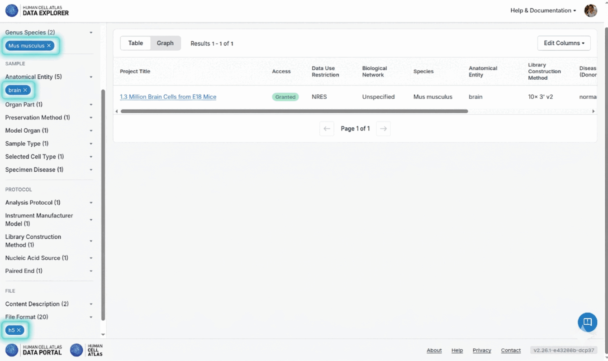
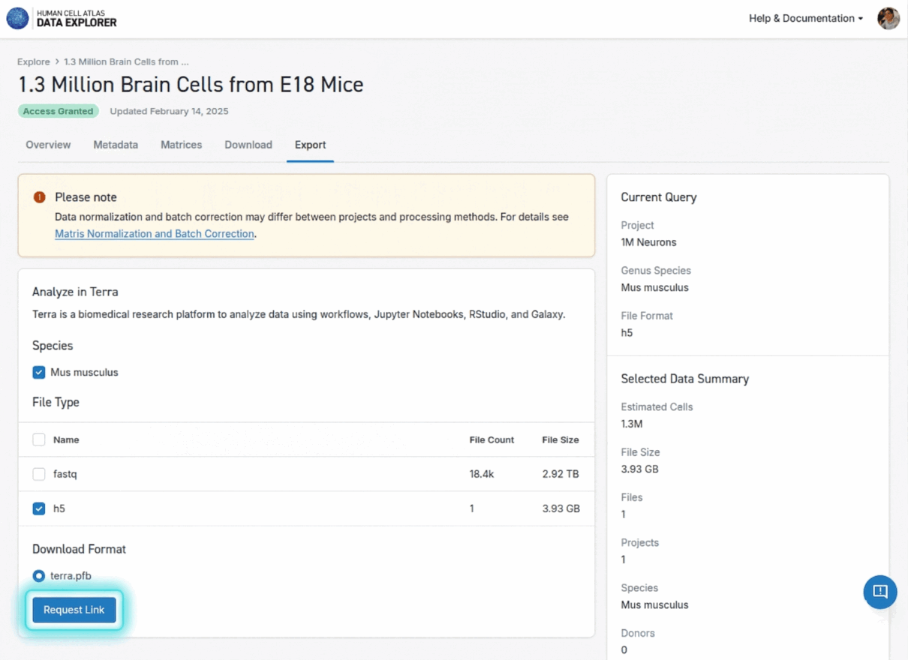
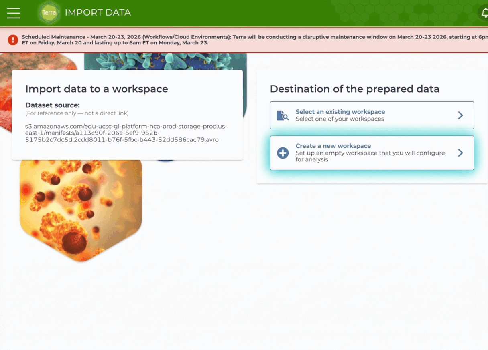

# BiocAzul

# Installation

Install the development version of the `BiocAzul` package from GitHub
using the following:

``` r
if (!require("BiocManager", quietly = TRUE))
    install.packages("BiocManager")
BiocManager::install("Bioconductor/BiocAzul")
```

# Package Loading

``` r
library(BiocAzul)
```

# Introduction

The `BiocAzul` package provides an interface to the Azul API, which is
used to index data from the Human Cell Atlas (HCA) and the AnVIL Data
Explorer. Azul provides a convenient query interface for searching and
retrieving data from these projects.

# Basic Usage

To get started, create an `Azul` service object. By default, it connects
to the Human Cell Atlas service.

``` r
hca <- Azul()
hca
#> service: hca
#> host: service.azul.data.humancellatlas.org
#> tags(); use azul$<tab completion>:
#> # A tibble: 25 × 3
#>    tag       operation                                            summary
#>    <chr>     <chr>                                                <chr>  
#>  1 Auxiliary Basic_health_check                                   Basic …
#>  2 Auxiliary Cached_health_check_for_continuous_monitoring        Cached…
#>  3 Auxiliary Complete_health_check                                Comple…
#>  4 Auxiliary Describe_current_version_of_this_REST_API            Descri…
#>  5 Auxiliary Fast_health_check                                    Fast h…
#>  6 Auxiliary Redirect_to_the_Swagger_UI_for_interactive_use_of_t… Redire…
#>  7 Auxiliary Return_OpenAPI_specifications_for_this_REST_API      Return…
#>  8 Auxiliary Robots_Exclusion_Protocol                            Robots…
#>  9 Auxiliary Selective_health_check                               Select…
#> 10 Auxiliary Static_files_needed_for_the_Swagger_UI               Static…
#> # ℹ 15 more rows
#> tag values:
#>   Auxiliary, Index, Manifests, Repository
#> schemas():
```

## Connecting to the AnVIL Data Explorer

To connect to the AnVIL Data Explorer instead, specify the provider when
creating the `Azul` object.

``` r
anvil <- Azul(provider = "anvil")
anvil
#> service: anvil
#> host: service.explore.anvilproject.org
#> tags(); use azul$<tab completion>:
#> # A tibble: 25 × 3
#>    tag       operation                                            summary
#>    <chr>     <chr>                                                <chr>  
#>  1 Auxiliary Basic_health_check                                   Basic …
#>  2 Auxiliary Cached_health_check_for_continuous_monitoring        Cached…
#>  3 Auxiliary Complete_health_check                                Comple…
#>  4 Auxiliary Describe_current_version_of_this_REST_API            Descri…
#>  5 Auxiliary Fast_health_check                                    Fast h…
#>  6 Auxiliary Redirect_to_the_Swagger_UI_for_interactive_use_of_t… Redire…
#>  7 Auxiliary Return_OpenAPI_specifications_for_this_REST_API      Return…
#>  8 Auxiliary Robots_Exclusion_Protocol                            Robots…
#>  9 Auxiliary Selective_health_check                               Select…
#> 10 Auxiliary Static_files_needed_for_the_Swagger_UI               Static…
#> # ℹ 15 more rows
#> tag values:
#>   Auxiliary, Index, Manifests, Repository
#> schemas():
```

Note that the `host` field in the objects output changes to reflect the
AnVIL Data Explorer service.

## Listing Catalogs

Azul organizes data into catalogs. You can list the available catalogs
using `listCatalogs()`.

``` r
catalogs <- listCatalogs(hca)
catalogs
#> [1] "dcp59"    "dcp59-it" "lm10"     "lm10-it"
latest <- head(catalogs, n = 1)
latest
#> [1] "dcp59"
```

## Exploring Projects

To get a quick overview of the projects in a catalog, use
`projectTable()`. This returns a `tibble` with project names and their
corresponding IDs.

``` r
projects <- projectTable(hca, catalog = latest)
head(projects)
#> # A tibble: 6 × 3
#>   term                                               count projectId     
#>   <chr>                                              <int> <chr>         
#> 1 -Human-10x3pv2--21                                     1 888f1766-4c84…
#> 2 1M Neurons                                             1 74b6d569-3b11…
#> 3 AIDA                                                   1 f0f89c14-7460…
#> 4 AIDA_DataFreeze_v2_JP                                  1 35d5b057-3daf…
#> 5 AIDA_DataFreeze_v2_TH                                  1 76bc0e97-8cae…
#> 6 ASingle-CellAtlasOfHumanPediatricLiverRevealsAge-R     1 febdaddd-ad3c…
```

## Exploring Facets

Azul data is organized by facets, which are attributes you can use to
filter and group data. You can list the available facets for a catalog
using `availableFacets()`.

``` r
facets <- availableFacets(hca, catalog = latest)
head(facets)
#> [1] "organ"              "sampleEntityType"   "dataUseRestriction"
#> [4] "project"            "sampleDisease"      "nucleicAcidSource"
```

You can also get a summary of values for a specific facet using
`facetTable()`.

``` r
facetTable(hca, facet = "genusSpecies", catalog = latest)
#> # A tibble: 3 × 2
#>   term                   count
#>   <chr>                  <int>
#> 1 Homo sapiens             508
#> 2 Mus musculus              55
#> 3 canis lupus familiaris     1
```

# Filtering and Queries

The `makeFilter()` function provides a convenient way to create filters
for querying the Azul API. It uses a formula-based syntax to define the
filter criteria.

``` r
filter <- makeFilter(
    ~  specimenOrgan == "brain" &
        genusSpecies == "Mus musculus" &
        fileFormat == "h5"
)
filter
#> $specimenOrgan
#> $specimenOrgan$is
#> [1] "brain"
#> 
#> 
#> $genusSpecies
#> $genusSpecies$is
#> [1] "Mus musculus"
#> 
#> 
#> $fileFormat
#> $fileFormat$is
#> [1] "h5"
```

The filter created above filters for projects that have specimens from
the brain, are from the species Mus musculus, and have files in the h5
format. This filter can be used in `importToTerra()` to import data that
matches these criteria. The image below shows the same filter applied
via the HCA Data Explorer interface.



# Integration with Terra

One of the main features of `BiocAzul` is the ability to import data
directly into a Terra workspace. This is done using the
`importToTerra()` function.

Note: This step requires a Terra workspace and appropriate permissions.
The following code is for demonstration purposes and is not executed in
this vignette.

``` r
importToTerra(
    hca,
    namespace = "your-terra-namespace",
    name = "your-terra-workspace",
    catalog = "dcp58",
    filters = filter
)
```

The equivalent operation in the Terra UI involves selecting a dataset
for import and clicking the “Request Link” button. See the image below
for an example.



Once the link is requested, the user will be able to import the data
into their workspace. The image below shows how the user can select
“Create a new workspace” to import the data into a new Terra workspace.



# Conclusion

The `importToTerra()` function conveniently simplifies the data import
process. By providing the desired filters and workspace information,
users can programmatically create a manifest, initiate the import job in
Terra, and poll for its completion, all without needing to interact with
the Terra UI.

# Session Information

<details>

<summary>

Click to see session information
</summary>

``` r
sessionInfo()
#> R version 4.6.0 RC (2026-04-22 r89945)
#> Platform: x86_64-pc-linux-gnu
#> Running under: Ubuntu 24.04.4 LTS
#> 
#> Matrix products: default
#> BLAS:   /usr/lib/x86_64-linux-gnu/openblas-pthread/libblas.so.3 
#> LAPACK: /usr/lib/x86_64-linux-gnu/openblas-pthread/libopenblasp-r0.3.26.so;  LAPACK version 3.12.0
#> 
#> locale:
#>  [1] LC_CTYPE=en_US.UTF-8       LC_NUMERIC=C              
#>  [3] LC_TIME=en_US.UTF-8        LC_COLLATE=en_US.UTF-8    
#>  [5] LC_MONETARY=en_US.UTF-8    LC_MESSAGES=en_US.UTF-8   
#>  [7] LC_PAPER=en_US.UTF-8       LC_NAME=C                 
#>  [9] LC_ADDRESS=C               LC_TELEPHONE=C            
#> [11] LC_MEASUREMENT=en_US.UTF-8 LC_IDENTIFICATION=C       
#> 
#> time zone: America/New_York
#> tzcode source: system (glibc)
#> 
#> attached base packages:
#> [1] stats     graphics  grDevices utils     datasets  methods   base     
#> 
#> other attached packages:
#> [1] BiocAzul_1.1.1  AnVIL_1.25.0    AnVILBase_1.7.0 dplyr_1.2.1    
#> [5] colorout_1.3-2 
#> 
#> loaded via a namespace (and not attached):
#>  [1] utf8_1.2.6           rappdirs_0.3.4       generics_0.1.4      
#>  [4] tidyr_1.3.2          futile.options_1.0.1 hms_1.1.4           
#>  [7] digest_0.6.39        magrittr_2.0.5       evaluate_1.0.5      
#> [10] fastmap_1.2.0        jsonlite_2.0.0       progress_1.2.3      
#> [13] formatR_1.14         promises_1.5.0       httr_1.4.8          
#> [16] purrr_1.2.2          rapiclient_0.1.8     codetools_0.2-20    
#> [19] httr2_1.2.2          cli_3.6.6            shiny_1.13.0        
#> [22] rlang_1.2.0          crayon_1.5.3         futile.logger_1.4.9 
#> [25] withr_3.0.2          yaml_2.3.12          otel_0.2.0          
#> [28] BiocBaseUtils_1.15.0 tools_4.6.0          httpuv_1.6.17       
#> [31] DT_0.34.0            lambda.r_1.2.4       GCPtools_1.3.0      
#> [34] curl_7.1.0           vctrs_0.7.3          R6_2.6.1            
#> [37] mime_0.13            lifecycle_1.0.5      htmlwidgets_1.6.4   
#> [40] miniUI_0.1.2         pkgconfig_2.0.3      pillar_1.11.1       
#> [43] later_1.4.8          glue_1.8.1           Rcpp_1.1.1-1.1      
#> [46] xfun_0.57            tibble_3.3.1         tidyselect_1.2.1    
#> [49] keyring_1.4.1        rstudioapi_0.18.0    knitr_1.51          
#> [52] xtable_1.8-8         htmltools_0.5.9      rmarkdown_2.31      
#> [55] compiler_4.6.0       prettyunits_1.2.0
```

</details>
